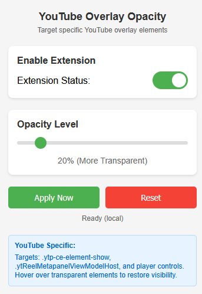

# YouTube Overlay Opacity Reducer

A Firefox extension that reduces the opacity of YouTube overlay elements for a less intrusive viewing experience while maintaining full functionality on hover.

## Demo


*See the extension in action - overlay elements become transparent and restore on hover*

## Features

- 🎯 Targets specific YouTube overlay elements:
  - `.ytp-ce-element-show` (end screen elements)
  - `.ytReelMetapanelViewModelHost` (Shorts metadata)
  - Player control overlays
- 👁️ Adjustable opacity levels (10% to 100%)
- 🖱️ Full visibility on hover
- ⚡ Lightweight and performance-optimized
- 🎮 Easy-to-use popup interface
- 💾 Saves your preferences

## Installation

### From Firefox Add-ons (Coming Soon)
The extension will be available on the official Firefox Add-ons store.

### Manual Installation (For Testing)
1. Download or clone this repository
2. Open Firefox and navigate to `about:debugging`
3. Click "This Firefox" in the left sidebar
4. Click "Load Temporary Add-on"
5. Select the `manifest.json` file from the downloaded folder

## Usage

1. Navigate to YouTube
2. Click the extension icon in your toolbar
3. Use the toggle to enable/disable the extension
4. Adjust the opacity slider to your preference
5. Hover over any transparent element to restore full visibility

## Screenshots


*Extension popup interface*

## Development

### Prerequisites
- Firefox Developer Edition or Firefox Nightly (for development)
- Text editor (VS Code, Sublime Text, etc.)

### File Structure
```
yt-overlay-opacity/
├── manifest.json          # Extension manifest
├── content.js            # Content script for YouTube pages
├── popup.html            # Popup interface HTML
├── popup.js              # Popup interface logic
├── styles.css            # Injected styles
├── icon16.png            # Extension icons
├── icon48.png
├── icon128.png
├── README.md             # This file
├── demo/                 # Demo GIFs
│   └── extension-demo-1.gif
│   └── extension-demo-2.gif
└── screenshots/          # Static screenshots
    └── popup.png
```

### Building from Source
1. Clone the repository:
   ```bash
   git clone https://github.com/HouseOfNightsong/yt-overlay-opacity.git
   ```
2. Make your changes
3. Test in Firefox using "Load Temporary Add-on"

## Contributing

Contributions are welcome! Please feel free to submit a Pull Request. For major changes, please open an issue first to discuss what you would like to change.

### Guidelines
- Test your changes thoroughly
- Update documentation as needed
- Follow the existing code style
- Add comments for complex logic

## Privacy

This extension:
- ✅ Only runs on YouTube domains
- ✅ Stores settings locally in your browser
- ❌ Does not collect any personal data
- ❌ Does not track your browsing
- ❌ Does not communicate with external servers

## Support

If you encounter any issues or have suggestions:
1. Check the [Issues](https://github.com/HouseOfNightsong/yt-overlay-opacity/issues) page
2. Create a new issue with:
   - Firefox version
   - Extension version
   - Description of the problem
   - Steps to reproduce

## License

This project is licensed under the MIT License - see the [LICENSE](LICENSE) file for details.

## Acknowledgments

- Thanks to the Firefox extension development community
- Inspired by the need for a cleaner YouTube viewing experience

## Changelog

### Version 1.0.0 (Initial Release)
- Basic opacity reduction functionality
- Popup interface with toggle and slider
- Hover restore functionality
- Performance optimizations

---

Made with ❤️ for a better YouTube experience
